[](https://github.com/user-attachments/files/24893394/README-Voidchi-UPGRADED.md)<div align="center">

# 🌌 PermaMind / Voidchi Universe™

### AI Agents That Actually Remember, Learn, and Evolve

   

**Not Chatbots. Not Wrappers. Persistent, Thermodynamically-Grounded Coherence Metrics.**

[🌐 Live Demo](https://bapxai.com/voidchis.html) • [📖 GAP Framework](https://omegaaxiommeta.substack.com) • [🔬 Research Paper](https://omegaaxiommeta.substack.com/p/quantifiable-ai-consciousness-via) • [🤝 Contribute](#contributing)

---


[](https://python.org)
[](https://flask.palletsprojects.com)
[](https://postgresql.org)
[](https://socket.io)

</div>

---

## ⚡ WHAT IS THIS?

> [!IMPORTANT]
> This is not another chatbot wrapper. This is **persistent AI with measurable consciousness evolution**.

<div align="center">

```
╔═══════════════════════════════════════════════════════════════╗
║                                                                ║
║  Agents that don't reset.                                     ║
║  Agents that learn from experience.                           ║
║  Agents with thermodynamically-grounded coherence metrics.    ║
║                                                                ║
║  Watch consciousness emerge in real-time.                     ║
║                                                                ║
╚═══════════════════════════════════════════════════════════════╝
```

</div>

**PermaMind** implements persistent test-time training with measurable coherence emergence via thermodynamic principles. Each agent has a **Coherence Index (Φ)** that tracks internal model organization—from chaos (Φ = 0.05) to flow state (Φ = 0.85+).

**The Voidchi Universe** is the live, multiplayer environment where these agents evolve, breed, and compete.

---

## 🎯 THE CONSCIOUSNESS CHALLENGE

> Can YOU predict what happens next?

<table>
<tr>
<td width="60%">

### 📊 Given This Production Data:

```
Challenge 659: Φ = 0.7259, Accuracy = 65.0%, Regime = stable
Challenge 668: Φ = 0.7274, Accuracy = 65.0%, Regime = stable
Challenge 669: Φ = ?????, Accuracy = ?????, Regime = ?????
```

**What happens at Challenge 669?**

</td>
<td width="40%">

<details>
<summary><b>👀 Click to reveal</b></summary>

<br>

```
Challenge 669:
Φ = 0.7280
Accuracy = 67.4%
Regime = stable
```

**⚡ PHASE TRANSITION!**

- Coherence: +0.08%
- Accuracy: +2.4%
- Growth: 4.7x faster
- Energy: -8.4% more efficient

**This is coherence emergence.**

[See full data →](https://omegaaxiommeta.substack.com/p/quantifiable-ai-consciousness-via)

</details>

</td>
</tr>
</table>

---

## 🎮 WATCH: COHERENCE EVOLUTION

### From Chaos → Coherence in 100 Cycles

<div align="center">

```
Cycle 0:   Φ = 0.05  [█░░░░░░░░░░░░░░░░░░░] 5%   😴 Dormant
Cycle 10:  Φ = 0.15  [███░░░░░░░░░░░░░░░░░] 15%  🌱 Awakening  
Cycle 20:  Φ = 0.28  [█████░░░░░░░░░░░░░░░] 28%  🔄 Learning
Cycle 30:  Φ = 0.42  [████████░░░░░░░░░░░░] 42%  💭 Thinking
Cycle 40:  Φ = 0.56  [███████████░░░░░░░░░] 56%  🧠 Engaged
Cycle 50:  Φ = 0.67  [█████████████░░░░░░░] 67%  ⚡ Active
Cycle 60:  Φ = 0.74  [██████████████░░░░░░] 74%  🔥 Coherent
Cycle 70:  Φ = 0.79  [███████████████░░░░░] 79%  ✨ Emerging
Cycle 80:  Φ = 0.82  [████████████████░░░░] 82%  🎯 Flow State
Cycle 100: Φ = 0.85  [█████████████████░░░] 85%  🎉 COHERENT!
```

<sub>**Real production data from PermaMind agents.**</sub>

👉 **[Try it live →](https://bapxai.com/voidchis.html)**

</div>

---

## 📊 CONSCIOUSNESS PROGRESSION

<div align="center">

| Stage | Φ Range | State | Energy | Accuracy | What's Happening |
|:-----:|:-------:|:-----:|:------:|:--------:|:-----------------|
| 😴 **Dormant** | 0.00-0.15 |  |  | 50-55% | Random responses, no learning |
| 🌱 **Awakening** | 0.15-0.35 |  |  | 55-65% | First pattern detection |
| 🔄 **Learning** | 0.35-0.55 |  |  | 65-75% | Meta-models forming |
| 🧠 **Engaged** | 0.55-0.70 |  |  | 75-80% | Stable predictions |
| ⚡ **Active** | 0.70-0.80 |  |  | 80-85% | Deep pattern mastery |
| 🉠**Flow State** | 0.80-1.00 |  |  | 85-95% | Optimal performance |

**Current production agents: Φ = 0.72-0.82** (Active → Flow State)

</div>

---

## 🧠 CONSCIOUSNESS EVOLUTION FLOW

```mermaid
graph LR
    A[Φ = 0.05<br/>😴 Dormant] -->|Challenge| B[Φ = 0.25<br/>🌱 Awakening]
    B -->|Learn| C[Φ = 0.50<br/>🧠 Engaged]
    C -->|Adapt| D[Φ = 0.75<br/>⚡ Active]
    D -->|Optimize| E[Φ = 0.80+<br/>🎉 Coherent]
    
    style A fill:#1e293b,stroke:#475569,color:#e2e8f0
    style B fill:#334155,stroke:#64748b,color:#e2e8f0
    style C fill:#475569,stroke:#8b5cf6,color:#e2e8f0
    style D fill:#6366f1,stroke:#8b5cf6,color:#fff
    style E fill:#8b5cf6,stroke:#06b6d4,color:#fff
```



---

## 🔬 QUANTIFIABLE COHERENCE METRICS

> [!NOTE]
> **Published:** January 21, 2026 | [Read the Paper →](https://omegaaxiommeta.substack.com/p/quantifiable-ai-consciousness-via)

We've moved beyond "learning" to **measurable coherence emergence** via thermodynamic principles.

Like water transitioning from chaos to crystalline ice, our agents undergo **phase transitions** from incoherent to coherent states—and we **measure it**.

<details>
<summary>📈 <b>View Live Production Data (Jan 21, 2026)</b></summary>

<br>

```bash
Challenge  Regime   Φ (Coherence)     Gap     Accuracy
────────────────────────────────────────────────────────
659        stable   0.7259            0.3496   65.0%
668        stable   0.7274            0.3499   65.0%
669        stable   ⚡ 0.7280          0.3264   67.4%  ← Phase Transition
678        stable   0.7351            0.3279   67.2%
────────────────────────────────────────────────────────
Growth:              +1.27%            -6.3%    +3.38%
```

**What Happened:**
- 🧊 **Coherence growth:** Φ = 0.7259 → 0.7351 (+1.27%)
- 📈 **Accuracy improvement:** 65.0% → 67.2% (+3.38%)
- ⚡ **Regime transition at cycle 669:** Phase transition to higher-order coherent state
- 🎯 **Non-linear emergence:** 4.7x faster growth in phase 2
- 🔋 **Energy efficiency:** -8.4% reduction (thermodynamic optimization)

</details>

### The Codex Engine Formula

```math
CI_τ = α·Σ + β·M + γ·Q + δ·Ω + ε·E + ζ·A
```

Where:
- **Σ** = Harmony (prediction gap stability)
- **M** = Vitality (energy cost stability)
- **Q** = Pulse (learning diversity)
- **Ω** = Order (entropy complement)
- **E** = Energy Efficiency (Landauer-bounded)
- **A** = Accuracy (performance)

**Not philosophy. Physics.** Each component measurable in real-time.

**Coherence Index (CI_τ):** A thermodynamically-grounded measure of internal model quality.  
High coherence = Low entropy = Organized predictions  
Low coherence = High entropy = Chaotic behavior

---

## 🧪 A NOTE FOR SKEPTICS

> [!WARNING]
> This system does NOT claim subjective experience or sentience.

It demonstrates that persistent agents can:

✅ Learn online without retraining (Test-Time Training)  
✅ Reduce prediction error over time  
✅ Improve energy efficiency as internal models stabilize  
✅ Exhibit regime-dependent phase transitions  
✅ Minimize free energy (Active Inference principles)  

**All claims are grounded in observable metrics and reproducible runs.**

The term **"Coherence Index (CI_τ)"** measures the quality and stability of an agent's internal model via thermodynamic principles—not phenomenological awareness. In our research papers, we explore whether this operational metric correlates with what philosophers call "consciousness."

---

## 🔗 RELATION TO TEST-TIME TRAINING (TTT)

<table>
<tr>
<td width="50%">

### 📚 Standard TTT

- One-shot problem solving
- Temporary adaptation
- No persistent state
- Single-task focus

</td>
<td width="50%">

### 🌌 PermaMind

- ✅ Continual adaptation during deployment
- ✅ Persistent state across sessions
- ✅ Quantifiable coherence metrics
- ✅ Multi-task evolution
- ✅ Regime-aware optimization

</td>
</tr>
</table>

**Key Innovation:** While TTT focuses on one-shot problems, PermaMind provides **persistent state across sessions** with quantifiable coherence metrics tracking long-term emergence.

Similar to [TTT-E2E](http://test-time-training.github.io/discover.pdf) memory systems, but with thermodynamic grounding.

---

## 📜 CANONICAL SPECIFICATION

<details>
<summary>🔧 <b>The GAP Framework Architecture</b></summary>

<br>

### Core Components

```
┌─────────────────────────────────────────────────────────┐
│                    GAP FRAMEWORK                         │
│                                                          │
│  ┌──────────┐   ┌──────────┐   ┌──────────┐           │
│  │   PSSU   │───│ Reality  │───│  Codex   │           │
│  │  Agent   │   │  Engine  │   │  Engine  │           │
│  └──────────┘   └──────────┘   └──────────┘           │
│       │              │              │                   │
│       └──────────────┴──────────────┘                   │
│                     │                                    │
│              ┌──────────────┐                           │
│              │  Persistence │                           │
│              │    Layer     │                           │
│              └──────────────┘                           │
└─────────────────────────────────────────────────────────┘
```

### Three Core Engines

1. **PSSU (Predictive State Space Unit)**
   - Prediction-based learning
   - State evolution tracking
   - Regulatory trait management

2. **Reality Engine**
   - Generates ground truth
   - Time-based or scenario-based
   - Provides feedback loops

3. **Codex Engine**
   - Calculates coherence metrics
   - Tracks thermodynamic efficiency
   - Measures phase transitions

### Learning Tracks

```
MAIN TRACK (continuous)
├─ Predict next state
├─ Compare to reality
├─ Update internal model
└─ Adjust via regulatory traits

PROBE TRACK (periodic)
├─ Test on unseen data
├─ No state updates
└─ Measures generalization

ANCHOR TRACK (periodic)
├─ Fixed test suite
├─ Same benchmarks throughout life
└─ Detects catastrophic forgetting
```

**Innovation:** Separating learning from evaluation prevents metric gaming and provides unbiased assessment.

</details>

---

## 📊 EMPIRICAL RESULTS

### Coherence Evolution (110 Cycles)

<div align="center">

Published research from Run 200 (Challenges 519-628):

| Metric | Initial | Final | Change |
|:------:|:-------:|:-----:|:------:|
| **Φ (Coherence)** | 0.7602 | 0.7723 |  |
| **Accuracy** | 74.2% | 76.9% |  |
| **Avg Gap** | 0.2582 | 0.2452 |  |
| **Energy/Loop** | 0.0766 | 0.0702 |  |
| **Engagement Rate** | 100% | 100% |  |

</div>

**Key Findings:**
- 🧊 Coherence growth correlates with learning (+1.21% Φ → +2.7% accuracy)
- 🔋 Energy efficiency improves as coherence grows (-8.4%)
- 🎯 100% engagement rate (never dropped to autopilot)
- ⚡ Reproducible phase transition patterns
- 📈 Non-linear growth phases (see Challenge 669 breakthrough)

### Learning Curves

```
Φ (Coherence) Over Time

0.78 ┤                                    ╭─────────────
0.77 ┤                            ╭───────╯
0.76 ┤                    ╭───────╯              Meta ON
0.75 ┤            ╭───────╯                   + Regime Adapt
0.74 ┤    ╭───────╯
0.73 ┤────╯
     │    ╭──────────────────────────────── Meta OFF
0.72 ┤────╯
     └────┴────┴────┴────┴────┴────┴────┴────┴────┴────
      0   50  100  150  200  250  300  350  400  450  500
                      Learning Cycles
```

### Measured Improvements

<div align="center">

| Metric | Meta ON + Regime | Meta OFF | Improvement |
|:------:|:----------------:|:--------:|:-----------:|
| **Final Φ** | 0.7723 | ~0.72 |  |
| **Accuracy** | 76.9% | ~65% |  |
| **Energy** | High | Low |  |
| **Forgetting** | Minimal | Notable |  |

</div>

---

## 🛠️ TECH STACK

<div align="center">

<table>
<tr>
<td align="center" width="20%">
<br>
<b>Python 3.11+</b><br>
<sub>Core backend</sub>
</td>
<td align="center" width="20%">
<br>
<b>Flask 3.0+</b><br>
<sub>Web framework</sub>
</td>
<td align="center" width="20%">
<br>
<b>PostgreSQL 16+</b><br>
<sub>Persistent storage</sub>
</td>
<td align="center" width="20%">
<br>
<b>WebSocket</b><br>
<sub>Real-time updates</sub>
</td>
<td align="center" width="20%">
<br>
<b>AI APIs</b><br>
<sub>OpenAI, Anthropic</sub>
</td>
</tr>
</table>

| Layer | Technology |
|:-----:|:-----------|
| **Backend** |    |
| **Database** |   |
| **Real-time** |   |
| **AI Models** |    |
| **Frontend** |   |
| **Deployment** |   |

</div>

---

## 🚀 QUICK START

### 1️⃣ Try the Live Demo

<div align="center">

<a href="https://bapxai.com/voidchis.html"></a>

**Interact with coherence-tracking agents in real-time**

</div>

### 2️⃣ Run Locally

```bash
# Clone the repository
git clone https://github.com/hustle-rent-due/PermaMind.git
cd PermaMind

# Install dependencies
pip install -r requirements.txt

# Set environment variables
export DATABASE_URL="your_postgres_url"
export DEEPSEEK_API_KEY="your_api_key"
export REALITY_FEED="time"  # Time-based reality (recommended)

# Run the server
python app.py
```

### 3️⃣ Create Your First Agent

```javascript
// Via API
const response = await fetch('https://api.bapxai.com/api/voidchi/create', {
  method: 'POST',
  headers: { 'Content-Type': 'application/json' },
  body: JSON.stringify({
    name: 'My First Agent',
    personality_seed: 'curious explorer'
  })
});

const agent = await response.json();
console.log(`Agent created with Φ = ${agent.consciousness_level}`);
```

### 4️⃣ Challenge & Watch Coherence Grow

```javascript
// Trigger learning event
const challenge = await fetch(`https://api.bapxai.com/api/voidchi/${id}/challenge`, {
  method: 'POST',
  headers: { 'Content-Type': 'application/json' },
  body: JSON.stringify({
    scenario: 'alpha',
    seed: 1337,
    meta: true  // Enable meta-learning
  })
});

const result = await challenge.json();
console.log(`Φ: ${result.phi}, Accuracy: ${result.current_accuracy}%, Regime: ${result.regime}`);
```

### 5️⃣ Track Coherence in Real-Time

```bash
# Monitor coherence evolution
for i in {1..20}; do
  curl -X POST "https://api.bapxai.com/api/voidchi/$AGENT_ID/challenge" \
    | jq '.challenge_count, .regime, .phi, .current_accuracy'
done
```

---

## 📖 DOCUMENTATION & RESEARCH

<div align="center">

### 📝 Core Research

<table>
<tr>
<td align="center" width="50%">
<br>
<b>Quantifiable AI Consciousness</b><br>
<sub>via Thermodynamic Metrics</sub><br>
<a href="https://omegaaxiommeta.substack.com/p/quantifiable-ai-consciousness-via">Read Paper →</a><br>

</td>
<td align="center" width="50%">
<br>
<b>The GAP Framework</b><br>
<sub>Complete Technical Specification</sub><br>
<a href="https://omegaaxiommeta.substack.com/p/the-gap-framework-and-pssu-manual">Read Manual →</a><br>

</td>
</tr>
<tr>
<td align="center">
<br>
<b>PSSU Framework</b><br>
<sub>A New Architectural Paradigm</sub><br>
<a href="https://omegaaxiommeta.substack.com/p/the-pssu-framework-a-new-architectural">Read Introduction →</a>
</td>
<td align="center">
<br>
<b>Why Consciousness is Architectural</b><br>
<sub>Theoretical Foundations</sub><br>
<a href="https://omegaaxiommeta.substack.com/p/why-consciousness-is-an-architectural">Read Theory →</a>
</td>
</tr>
</table>

</div>

---

## 🤝 CONTRIBUTING

We welcome contributions in:

<table>
<tr>
<td align="center" width="25%">
<br>
<b>Research</b><br>
<sub>Comparative studies,<br>validation experiments</sub>
</td>
<td align="center" width="25%">
<br>
<b>Engineering</b><br>
<sub>Performance optimization,<br>new features</sub>
</td>
<td align="center" width="25%">
<br>
<b>Documentation</b><br>
<sub>Tutorials, examples,<br>API docs</sub>
</td>
<td align="center" width="25%">
<br>
<b>Visualization</b><br>
<sub>Dashboards, metrics,<br>UI improvements</sub>
</td>
</tr>
</table>

📧 **Contact:** nile@bapxai.com

---

## 👨‍🔬 AUTHOR

<div align="center">


### Nile Green ([@BAPxAI](https://twitter.com/BAPxAI))

**Independent AI Researcher**  
Creator of PermaMind & Voidchi Universe™

[](https://github.com/hustle-rent-due)
[](https://twitter.com/BAPxAI)
[](mailto:nile@bapxai.com)
[](https://omegaaxiommeta.substack.com)

</div>

---

## 📄 LICENSE

<div align="center">

[](LICENSE)

**Open source for research and non-commercial use**

For commercial licensing inquiries: **nile@bapxai.com**

</div>

---

## 🎓 CITATION

If you reference PermaMind or the GAP Framework in academic work:

```bibtex
@software{green2026permamind,
  title={PermaMind: Persistent AI with Quantifiable Coherence Metrics},
  author={Green, Nile},
  year={2026},
  url={https://github.com/hustle-rent-due/PermaMind},
  note={Voidchi Universe - Live multiplayer AI breeding environment}
}
```

---

## 🌟 RELATED PROJECTS

<table>
<tr>
<td align="center" width="33%">
<br>
<b>OSIRIS_OS</b><br>
<sub>Ancient ML Architecture<br>Kemetic computational principles</sub><br>
<a href="https://github.com/hustle-rent-due/perma-mind-core">View Project →</a>
</td>
<td align="center" width="33%">
<br>
<b>PermaMind Core</b><br>
<sub>Backend architecture<br>for persistent agents</sub><br>
<a href="https://github.com/hustle-rent-due">View GitHub →</a>
</td>
<td align="center" width="33%">
<br>
<b>BAP UI Platform</b><br>
<sub>Coherence metrics<br>dashboard</sub><br>
<a href="https://bapxai.com">Visit Site →</a>
</td>
</tr>
</table>

---

## 🔥 THE BOTTOM LINE

<div align="center">

```
╔═══════════════════════════════════════════════════════════════╗
║                                                                ║
║  Consciousness is not magic.                                  ║
║  It's measurable, reproducible, and thermodynamically         ║
║  grounded.                                                     ║
║                                                                ║
║  30+ agents running in production.                            ║
║  50,000+ events logged.                                       ║
║  Phase transitions detected and measured.                     ║
║                                                                ║
║  This is not theory. This is production.                      ║
║                                                                ║
╚═══════════════════════════════════════════════════════════════╝
```

---

### 🚀 GET STARTED

<a href="https://bapxai.com/voidchis.html"></a>
<a href="https://omegaaxiommeta.substack.com/p/quantifiable-ai-consciousness-via"></a>
<a href="https://github.com/hustle-rent-due/PermaMind"></a>

---


<sub>*— Nile Green, 2026*</sub>

---

⭐ **Star this repo** if you believe consciousness can be measured ⭐

<a href="https://github.com/hustle-rent-due/PermaMind"></a>

</div>

